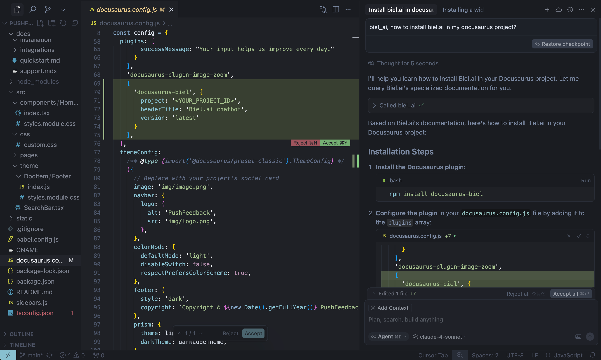

<div align="center">
  <picture>
    <source media="(prefers-color-scheme: dark)" srcset="./logo-dark.png" />
    
  </picture>
  <h1>Biel.ai MCP Server</h1>
  <h3>Connect your IDE to your product docs</h3>
</div>


Give AI tools like Cursor, VS Code, and Claude Desktop access to your company's product knowledge through the [Biel.ai platform](https://biel.ai).

Biel.ai provides a hosted Retrieval-Augmented Generation (RAG) layer that makes your documentation searchable and useful to AI tools. This enables smarter completions, accurate technical answers, and context-aware suggestions—directly in your IDE or chat environment.



When AI tools can read your product documentation, they become **significantly** more helpful—generating more accurate code completions, answering technical questions with context, and guiding developers with real-time product knowledge.


> **Note:** Requires a Biel.ai account and project setup. **[Start your free 15-day trial](https://app.biel.ai/accounts/signup/)**.

<h3><a href="https://docs.biel.ai/integrations/mcp-server?utm_source=github&utm_medium=referral&utm_campaign=readme">See quickstart instructions →</a></h3>

## Getting started

### 1. Get your MCP configuration

```json
{
  "mcpServers": {
    "biel-ai": {
      "description": "Query your product's documentation, APIs, and knowledge base.",
      "command": "npx",
      "args": [
        "mcp-remote",
        "https://mcp.biel.ai/sse?project_slug=YOUR_PROJECT_SLUG&domain=https://your-docs-domain.com"
      ]
    }
  }
}
```

**Required:** `project_slug` and `domain`  
**Optional:** `api_key` (only needed for private projects)

### 2. Add to your AI tool

* **Cursor**: **Settings** → **Tools & Integrations* → **New MCP server**.
* **Claude Desktop**: Edit `claude_desktop_config.json`  
* **VS Code**: Install **MCP extension**.

### 3. Start asking questions

```
Can you check in biel_ai what the auth headers are for the /users endpoint?
```

## Choose generated answers or search

The server exposes three tools:

- `biel_ai`: ask Biel.ai to generate an answer, with conversational context. Existing calls using `message` continue to generate answers.
- `biel_search`: hybrid keyword and semantic search over indexed web pages, uploaded files, repositories and OpenAPI sources, without answer generation.
- `biel_get_document`: read the complete indexed text of a document returned by search.

Call `biel_search` with a natural-language question or search terms:

```json
{"query": "How do I authenticate with the SDK?", "limit": 5}
```

Search requests the API's `search_type=hybrid&source_types=all`. The REST API defaults to `search_type=keyword`, independently of the selected sources. Results include chunk text, source type, a `document_id`, and any page/sheet reference; non-URL documents are cited by title and location. The `limit` argument controls how many chunks are returned (default 5, maximum 20).

Use `biel_get_document` with a search result's `document_id` to read the complete indexed document without visiting its source site:

```json
{"document_id": "DOCUMENT_ID_FROM_SEARCH", "limit": 20}
```

Get returns full indexed chunks in reading order, with PDF page and spreadsheet sheet references. Large documents include a `next_cursor`; repeat the call with that cursor and the same `document_id` and `limit` until it is absent. This returns the indexed text, not the original binary upload or live page HTML. References belong to the project's active index generation: search again after a recrawl invalidates a reference. Older repository and OpenAPI sources require a recrawl to populate parent-document identity before get is available.

Search and get do not create or continue a chat. Private projects require an API key with the `search` scope; generated answers use `chats_create`. All operations retain the API's project access, domain and quota checks. The default workflow is **search → get → answer using the retrieved text**. If the calling agent wants Biel.ai to generate an answer, it should ask the user first unless the user has already explicitly requested that. Retrieval failures never automatically switch to generated answers.

## Self-hosting (Optional)

For advanced users who prefer to run their own MCP server instance:

### Local development
```bash
# Clone and run locally
git clone https://github.com/TechDocsStudio/biel-mcp
cd biel-mcp
pip install .
biel-mcp
```

### Use as a Python package

Applications that host their own ASGI stack can install the server directly
from a tagged revision and import its FastAPI application:

```bash
pip install "biel-mcp @ git+https://github.com/TechDocsStudio/biel-mcp.git@VERSION"
```

```python
from biel_mcp.server import app
```

### Docker deployment
```bash
# Docker Compose (recommended)
docker-compose up -d --build

# Or Docker directly
docker build -t biel-mcp .
docker run -d -p 7832:7832 biel-mcp
```

### Request timeout and continuation

`BIEL_MCP_READ_TIMEOUT_SECONDS` sets the upstream API read timeout (default: 60 seconds). Connect and pool timeouts remain 5 seconds, and writes have a 10-second timeout. Client deadlines can still end a request earlier.

Conversation credentials remain in the MCP session. After HTTP 404 for an expired session, initialize a new connection without the old session id. Tool failures return `isError: true`; the server logs `mcp.upstream_completed` with duration, status and the upstream request id.

## Support

- **Issues**: [GitHub Issues](https://github.com/techdocsStudio/biel-mcp/issues)
- **Contact**: [support@biel.ai](mailto:support@biel.ai)
- **Custom Demo**: [Book a demo](https://biel.ai/contact)
